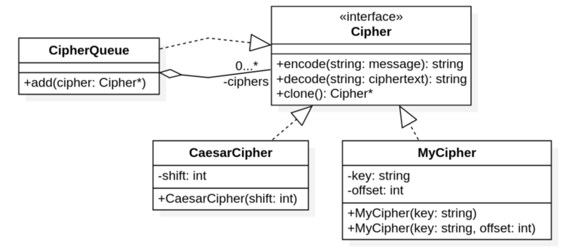

# Titkosítás
Szorgalmi feladat __Karsa Zoltán__tól. (extra pont: 4) 

A következő szorgalmi feladatban 2 nagyon egyszerű titkosítást kell megvalósítani. Az egyik a Caesar titkosítás, míg a másik egy saját ötlet. Ezen kívül egy CipherQueue osztályt is el kell készíteni, ami összetett, többszintű titkosítást tesz lehetővé. Meg kell jegyezni hogy ezek nagyon gyenge titkosítási eljárások, inkább csak iskolapéldája az öröklésnek és a heterogén kollekciónak.

## ABC
A feladatban az egyszerűség kedvéért csak az angol ábécé kisbetűit (a -tól z, 26 db) és szóközöket tartalmazó üzeneteket kell kódolni. A kódolás során a szóközök változatlanok maradnak, és az ábécé minden kisbetűjének képe az ábécé egy kisbetűje lesz.

## Osztálydiagram

 

A feladatban az osztálydiagramon szereplő osztályokat kell megvalósítani. Az osztályokhoz tartozó pontos specifikáció itt olvasható:

### Cipher
Absztrakt interfész-ősosztály tisztán virtuális függvényekkel.

 * __encode(message)__ a paraméterül kapott `std::string` üzenetből létrehozza a neki megfelelő titkosított szöveget
 * __decode(ciphertext)__ a paraméterül kapott `std::string` titkosított szövegből visszaadja az üzenetet.
 * __clone()__ létrehoz a példányból egy dinamikus másolatot

*Az __encode/decode__ függvények minden leszármazottnál kivételt dobnak ha az átvett `string`-ben van az értelmezési tartományhoz (angol abc kis betűi + szóköz) NEM tartozó karakter, a kivétel a __Neptun__ kódod!*

Megadtuk a __Cipher__ interfész kódját is:
```c++
class Cipher {
public:
    virtual std::string encode(const std::string& message) = 0;
    virtual std::string decode(const std::string& chipertext) = 0;
    virtual Cipher* clone() const = 0;
    virtual ~Cipher() { };
};
```

### CaesarCipher
A CaesarCipher osztály a Caesar-titkosítást valósítja meg. Ez az eljárás a bejövő üzenet minden karakterét egy konstanssal (__shift__) tolja el, ez a konstans a titkosítás kulcsa.

Alább egy példát mutatunk shift=3 beállítással (figyeld a szóközök változatlanságát és az utolsó három karakter kódolását is)
```
Be: abcdefgh ijklmnop qrstuvwxyz
Ki: defghijk lmnopqrs tuvwxyzabc
```

Figyelem, a __shift__ lehet negatív is, vagy akár 26-nál nagyobb is!

A Caesar titkosítást megvalósító osztály természetesen implementálja a fenti interfészt, ezen kívül konstruktora képes a shift paraméter eltárolására:

 * __CaesarCipher(shift)__ a konstruktorban az eltolás mértéke állítható be.

### MyCipher
Az osztály __encode/decode__ függvényei a Caesar-kódoláshoz hasonlóan eltoláson alapulnak, de az eltolás mértéke nem állandó, hanem karakterről karakterre változik az alábbi szabály szerint:

A kód kulcsa egyrészt egy sztring (__key__), másrészt egy egész eltolás (__offset__). A bejövő szöveg __i__-edik karakterének képét úgy kapjuk meg, hogy azt eltoljuk __offset + i__-vel, továbbá eltoljuk a __key__ string __i__-edik karakterének `a`-tól számított numerikus értékével is. Amennyiben a bejövő szöveg hosszabb, mint a __key__ sztring, akkor __key__ sztring karaktereit az elsőtől kezdve ismételjük. A __key__ sztring nem tartalmazhat szóközt.

Ennek értelmében, amennyiben a __key__ sztring értéke `abc`, valamint __offset__ értéke -2, akkor a `hello bello` üzenet kódolás utáni képe 

|üzenet         | `h`(7) | `e`(4) | `l`(11) | `l`(11) | `o`(14) | `' '`  | `b` | `e` | `l` | `l` | `o` |
|---------------|-----|-----|------|------|------|---|---|---|---|---|---|
|__key__        | `a`(0) | `b`(1) | `c`(2)  | `a`(0)  | `b`(1)  | `c` | `a` | `b` | `c` | `a` | `b` |
|__offset__ + __i__ | -2  | -1  | 0    | 1    | 2    | 3 | 4 | 5 | 6 | 7 | 8 | 
|kódolt szöveg  | `f`(5) | `e`(4) | `n`(13) | `m`(12) | `r`(17)    | `' '`  | `f` | `k` | `t` | `s` | `x` |


A dekódolásház a Caesar titkosításhoz hasonlóan, az ellenkező irányba történő eltolást kell alkalmazni. 

Az osztály konstruktorai:

 * __MyCipher(key)__ beállítja a kulcsot és az ofszetet 0-ra.
 * __MyChipher(key, offset)__ beállítja a kulcsot és az ofszetet

Figyelem, a __offset__ lehet negatív is!

### CipherQueue

A harmadik kódoló osztály összetett kódolót valósít meg, mely tetszőleges kódolók egymás utáni alkalmazására képes. Megvalósítása __Cipher__-leszármazottakat tartalmazó heterogén kollekcióval történik: Azaz __Cipher__ pointereket kell tárolni, ezt sugallja is az osztály függvényei:

Függvények:

 * __add(Cipher*)__ egy dinamikusan foglalt kódoló címét veszi át, és a pointert eltárolja a sor végén, később az osztály feladata ezt felszabadítani.
 * __encode(message)__ végighalad a tárolt rejtljelezőkön a hozzáadás sorrendjében: először feldolgozza az üzenetet az első hozzáadott titkosító, majd annak eredményét a 2. rejtjelező továbbtitkosítja... végül visszaadja a többszinten titkosított szöveget.
 * __decode(ciphertext)__ dekódolja a titkosított üzenetet, ehhez visszafele kell haladni a sorban.
 * __CipherQueue(CipherQueue const &)__ másoló konstruktor. Célszerű elkészíteni a __clone__ függvény implementálásához

Figyelj a virtuális függvényekre és a destruktorra, figyeld meg az osztálydiagramon látható jelöléseket, azok alapján dolgozz, továbbá tegyél minden függvényt konstans tagfüggvénynek, amit csak lehet!

## Megoldás
A Git tárolóból letölthető [https://git.ik.bme.hu/Prog2/szorgalmi_feladatok/cipher](https://git.ik.bme.hu/Prog2/szorgalmi_feladatok/cipher)
fájlok felhasználásával hozz létre a lokális fejlesztőkörnyezetedben egy C++ projektet! Ehhez felhasználható a *Makefile*, amiben megtalálhatók a fordítási opciók. Tervezz, fejlessz, tesztelj, majd töltsd fel a megoldást a Jporta rendszerbe! 

## Tiltott szavak
A megoldás során nem kell (nem lehet) semmilyen explicit cast operátor, ezért ezek használatát tiltjuk. A Jporta egyszerű szövegkereséssel ellenőrzi a feltöltött fájlokat, hogy szerepel-e bennük "\_cast", de azt nem hogy milyen kontextusban találja meg azt. __Így a "\_cast" minta nem szerepelhet változónévben, string-ben, kommentben ... sem!__

## Beadás
Feltöltendő a `ciphers.h` és `ciphers.cpp`, a teszteléshez definiáltuk az `ELKESZULT` makrót, amit a `test.cpp` fájlban kell beállítani, de ezt a fájlt nem kell feltölteni. 
